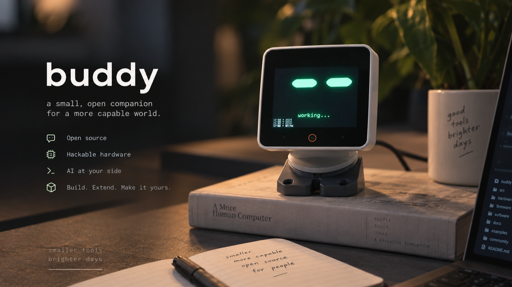

# buddy



A small, open companion for a more capable world. A desk pet on an ESP32-S3 touchscreen
that reacts to **Claude Code** in real time. It sleeps
when you're idle, gets busy when Claude is working, and demands attention when Claude is
blocked on you. Permission prompts arrive as a card you approve or deny by swiping —
right to approve, left to deny.

Four builds, three boards: the touch **pet**, the CrowPanel e-ink **monitor-and-control**
dock, a **monitor-only** variant of that same e-ink board — a read-only landscape
wallboard of your live agents — and the **StackChan robot**, a head that turns to look at
you. See [E-ink build](#e-ink-build-crowpanel-42),
[E-ink agent monitor](#e-ink-agent-monitor-variant) and [StackChan](#stackchan-m5stackchan-k151).

Two MIT projects ported to the **Freenove FNK0104B** (ESP32-S3 Display 2.8" Touch):
[anthropics/claude-desktop-buddy](https://github.com/anthropics/claude-desktop-buddy) for the
firmware (the 7-state pet, retargeted from the M5StickC Plus) and
[SnowWarri0r/cc-buddy-bridge](https://github.com/SnowWarri0r/cc-buddy-bridge) for the host
daemon (extended with a USB serial transport in place of BLE).

```
Claude Code CLI ─hooks→ unix socket → bridge daemon ─NDJSON over USB serial→ ESP32-S3
   └─ JSONL tailer (tokens, transcript entries) ┘        pet state machine + touch UI
```

## What it does

- **Mirrors Claude's state.** Sleeping, busy, waiting, celebrating — driven by Claude Code
  hooks plus a tailer over the session transcripts for tokens and message counts.
- **Approves tool calls from the board.** Risky commands (`git push`, `rm`, …) and reads
  outside the session directory render as a swipe card. The card shows which session is
  asking, how many more prompts wait behind it (a peeking deck + "+N" badge), and a bar
  draining toward the 300s terminal fallback. Destructive commands (`rm`, `sudo`,
  `git reset --hard`, …) get a red border and need a longer, harder swipe to approve.
  Tap the card for a full-screen view of the whole command; hold it at the right edge to
  approve **and stop being asked** for that command shape (daemon lifetime). Approving a
  read grants its whole enclosing repo for the daemon's lifetime.
- **Summons your terminal.** Tap the pet while it demands attention and the daemon raises
  the terminal of the session that's blocked on you (swipe up on a permission card for the
  same, without deciding). Window-level matching by the session's repo name works everywhere —
  AppleScript for iTerm2/Terminal.app, Accessibility (AXRaise) for Ghostty, Warp, cmux and
  friends — falling back to raising the app; the app order is configurable via
  `CC_BUDDY_FOCUS_APPS`.
- **Push-to-talk dictation (opt-in).** Set `CC_BUDDY_VOICE_HOTKEY` and holding the pet makes
  the daemon hold your dictation app's global hotkey until you let go — app-agnostic, it just
  holds a chord. Off by default: out of the box buddy never presses a key or opens the mic.
- **Hands-on-pet option picking.** Swipe left/right to walk Claude Code's option pickers
  (Up/Down arrows), swipe down for Enter — so the loop is: hold to dictate, release,
  swipe to choose, swipe down to send.
- **Always shows the time.** A small clock sits top-left of the pet whenever the bridge has
  synced the RTC.
- **Reports its own crashes — and recovers alone.** `cc-buddy-bridge diag` prints why the
  board last reset, what it was doing, and which loop phase hung, from an event ring that
  survives panics and watchdog reboots. The daemon watches the link both ways and escalates
  from reconnects (with a deliberate closed-port hold) up to an automatic RTS hardware reset
  of the board, so a wedged link heals without touching a cable.

## Hardware

| Part | Detail |
|---|---|
| MCU | ESP32-S3, 16MB QIO flash, 8MB OPI PSRAM, native USB-Serial/JTAG |
| LCD | ILI9341(V) 240×320 SPI — MOSI 11 / SCLK 12 / CS 10 / DC 46, backlight GPIO45 |
| Touch | FT6336G @ I2C 0x38 — SDA 16 / SCL 15 / INT 17 / RST 18 |
| Extras | WS2812 LED (GPIO42), ES8311 codec + mic + speaker (unused), microSD, battery ADC GPIO9 |

## E-ink build (CrowPanel 4.2")

A second board target: the **Elecrow CrowPanel ESP32 4.2" E-Paper HMI**
(ESP32-S3-WROOM-1-N8R8, SSD1683, 400×300 black/white, CH340 UART on the
USB-C) — `firmware/claude_pet_eink`, same NDJSON protocol, **no pet**: on
e-paper the build is a purely functional portrait status display — big
clock + date, a state banner (IDLE / WORKING / NEEDS YOU / DONE!), session
and token counters, the tail of the live transcript, and permission prompts
as a full-screen card. Redraws happen on state changes, prompt traffic, and
the minute tick: partial refresh for routine updates, a fast full refresh
every 24 partials (and on card in/out) to clear ghosting, deep sleep between
updates. The front controls (two buttons + a rocker/press "slider"):

| Control | No card up | Card showing |
|---|---|---|
| slider press (OK) | Enter on the Mac | approve once; hold 0.7s = always. Destructive prompts *require* the hold — a short tap just draws "HOLD OK to approve" |
| slider up / down | previous / next option in Claude Code's pickers | up = approve once, down = deny — the swipe, made physical. Destructive prompts won't approve from a flick; they point you at the OK hold |
| EXIT | **hold = push-to-talk** — the daemon holds your dictation hotkey until you let go | deny |
| MENU/HOME | raise the blocked session's terminal | raise the asking session's terminal (card stays pending) |

```bash
./tools/flash_eink.sh    # compile + archive ELF + flash (through `hwlog flash` when its daemon owns the port)
cc-buddy-bridge install --service --serial-port '/dev/cu.usbserial-*'   # CH340 enumerates as usbserial, not usbmodem
```

GIF character packs don't apply on a 1-bit panel with no filesystem — the
board refuses `char_begin` at the handshake, and the daemon logs one cosmetic
"LittleFS unformatted" error per connect. `name`/`owner`/`species` commands
all ack. See `firmware/claude_pet_eink/README.md` for the vendored Elecrow
panel driver (including the old-image-plane fix that stops partial-refresh
text overlap) and the pin map, and DESIGN.md for the port notes.

## StackChan (M5StackChan K151)

A third board: the **M5StackChan AI Desktop Robot** (K151 — CoreS3 core,
ESP32-S3, 320×240 LCD, GC0308 camera, two Feetech serial servos for yaw and
pitch, 12 RGB LEDs, a three-zone top touch pad, speaker) —
`firmware/claude_pet_stackchan`, same NDJSON protocol over the native
USB-Serial/JTAG port (`/dev/cu.usbmodem*`; opening it does not reset the
board). The face is FluxGarage RoboEyes on a 1-bit canvas with a random eye
colour per boot and one status word, no clock. The body does the talking:
eased head motion (an `easeInOutCubic` tween at 25 Hz on top of the BSP's
servo spring), idle micro-drift, LED moods, and R2D2 chirps synthesized to
PCM at 16 kHz. Three states must read at a glance:

| State | Claude | Head | Eyes | LEDs |
|---|---|---|---|---|
| sleep | connected, idle | chin down, torque off | closed, a peek every ~20 s | dim blue breathe |
| busy | a session running | level, nods every 2.5 s | squint | dim cyan |
| attention | a session waits on you | up, then a two-row search sweep until it finds you | angry flicker; sweat on a destructive prompt | orange pulse |
| listening | Option held on the Mac | faces you | wide | blue |

**Host vision.** The daemon turns the camera on (`{"cmd":"cam",...}`); the board
streams 160×120 JPEGs (~2.5 KB at ~4 fps); macOS Vision finds the largest
face in 5–20 ms and answers `{"cmd":"face",...,"who":"owner"|"unknown"}`, which
drives the head. Hold Option while facing it to enrol yourself as owner
(Vision feature prints, threshold 0.9); the board keeps a habit map of where
you sit in NVS and searches there first. On-board motion/skin tracking is the
fallback with no host. After 10 idle minutes the daemon pans the room and
writes one-sentence notes (`gpt-5-mini`, 6/hour) to
`~/.config/cc-buddy-bridge/notes/`, shown by the WidgetKit widget in `widget/`
or `cc-buddy-bridge notes-widget`.

```bash
./tools/flash_stackchan.sh     # compile + archive ELF + flash; boots the daemon out first
cc-buddy-bridge install --service --serial-port '/dev/cu.usbmodem*'
```

Daemon flags used with the robot: `CC_BUDDY_MONITOR_ONLY=1` in the plist env
(no permission cards on the robot; taps only focus the terminal),
`~/.config/cc-buddy-bridge/matchers.toml` with `replace_defaults = true` and
an empty `always_ask`, and `OPENAI_API_KEY` in `~/.config/cc-buddy-bridge/env`
(mode 600 — the launchd daemon does not read `.zshrc`). The listen key needs
**Input Monitoring** for the daemon's python. Back up the factory image
before the first flash (`esptool ... read-flash`, no `-b` on this link);
restore with `esptool write-flash 0x0 firmware/build-archive/stackchan-factory-20260905.bin`.

| Control | Action |
|---|---|
| Front zone tap | attention: raise the blocked terminal. Otherwise a head pat: heart, pink LEDs |
| Middle zone hold (0.6 s) | push-to-talk, same as holding the panel |
| Back zone | scroll the transcript (same as the bottom-right strip) |
| Panel gestures | as the touch pet: hold = dictate, swipe down = Enter, left/right = option pickers |

Full reference: [docs/stackchan/build.md](docs/stackchan/build.md) (port map,
gaze policy, wire additions, bench-verified conventions); research in
[capabilities.md](docs/stackchan/capabilities.md) and [repos.md](docs/stackchan/repos.md).

## E-ink agent monitor (variant)

`firmware/claude_pet_eink_monitor` is a **variant of the e-ink build for the
same CrowPanel hardware** — not a third board, and not a replacement.
`claude_pet_eink` remains the **monitor-and-control** build: it shows status
*and* you act on it, approving prompts with the buttons. This variant is
**monitor-only** — a read-only landscape wallboard that answers "what are my
agents doing right now" and nothing else. Same NDJSON protocol, same driver,
same flashing dance; pick whichever suits the board's job and flash that one.

|  | `claude_pet_eink` | `claude_pet_eink_monitor` |
|---|---|---|
| Orientation | portrait 300×400, USB-C down | landscape 400×300, USB-C **left** |
| Permission cards | full-screen card, buttons decide | **never drawn** — approvals happen in the terminal |
| Buttons | OK / EXIT / slider / MENU all live | **inert** (pins still configured) |
| Per-agent rows | — | up to 6: name, state, current tool |
| Panel refresh | partial + periodic full | **full init + full refresh every frame** |
| Daemon | default | **requires `CC_BUDDY_MONITOR_ONLY=1`** |

The screen is a clock + AM/PM date, a state banner, `N sess / N run`, today's
tokens, an `AGENT / STATE / TOOL` table of live sessions (waiting first, then
running, then idle — ordered by rank then name so rows don't hop between
refreshes), and the transcript tail filling whatever is left.

```bash
./tools/flash_eink_monitor.sh    # compile + archive ELF + flash
CC_BUDDY_MONITOR_ONLY=1 cc-buddy-bridge daemon   # or add it to the service env
```

**Set `CC_BUDDY_MONITOR_ONLY=1` — the firmware and the flag are a matched
pair.** Without it the daemon still surfaces permissions to a board whose
buttons no longer answer, so every prompt stalls the tool call for the full
`PERMISSION_WAIT_SECS` (300s) before falling back to the terminal. With it,
the daemon takes the same defer path it uses for a disconnected board, so
Claude Code's own prompt runs immediately. The `auto_allow` / `stick_always`
matcher fast paths are unaffected — they never touched the screen.

Two behaviours worth knowing:

- **Sessions self-register.** `SessionStart` is normally the only hook that
  creates a session, so a daemon restart used to leave every already-running
  session invisible until you restarted it too. Tool hooks now adopt unknown
  sessions (and backfill the `cwd` that names the row), so the list heals
  within one tool call. A row labelled with a six-char hex prefix instead of
  a repo name is a session that hasn't hit a `cwd`-carrying hook yet.
- **The clock self-heals.** The host sends `{"time":...}` once on connect, and
  opening the CH340 port toggles DTR/RTS — which resets the board, so the sync
  can land while the ESP32 is still in its ROM bootloader and be lost. The
  board re-emits its boot banner while it has no clock; the daemon's existing
  boot detector replays the resync and it goes quiet once time arrives.

### Why this variant does not use partial refresh

`EPD_Wake()` does reset + soft-reset + temperature-select only — it never
re-sends data-entry mode (`0x11`), the address window, or the cursor, all of
which `EPD_Init()` sets and a hardware reset clears. So from the second
sleep/wake cycle on, a partial refresh writes into an unconfigured controller
and nothing lands, **silently**, because `EPD_ReadBusy()` gives up after 8s
and returns normally. The symptom is a frozen panel while the firmware
happily counts renders. This variant therefore runs a full `EPD_Init()` +
`EPD_Display()` every frame — the same sequence `EPD_Clear()` uses at boot —
rate-limited by `MIN_FRAME_MS`. It costs a ~2s flashing refresh, deghosts for
free, and makes the panel self-healing: a controller wedged by a mid-refresh
reset recovers on the next frame instead of staying dead until a power cycle.
`claude_pet_eink` still uses the partial path and is still exposed to this.

**The bridge is board-agnostic.** Any device that speaks the NDJSON contract
over a serial port (or BLE NUS) is a valid pet: parse the heartbeat
(`total`/`running`/`waiting`/`prompt`/`entries`/`time`), print `[alive]`
every 5s, answer `{"cmd":"status"}` with a status ack, and emit
`permission`/`focus`/`key`/`voice` verbs from whatever inputs the hardware
has. The three firmwares here (240×320 touch LCD, 400×300 e-paper + buttons,
and the monitor-only variant of that same e-paper board) are just modalities
of the same protocol — and the monitor variant shows the floor: a board that
only ever *reads* the heartbeat is still a valid client, it simply emits no
verbs. DESIGN.md's e-ink section documents the exact contract a new board
must keep.

## Printable shell


A parametric three-part case lives in `case/` — `shell.py` builds it headless in FreeCAD
and exports STLs to `case/export/`. Frame (bezel + walls, print face down), back cover
(screw bosses, WS2812 glow window, BOOT/RESET pokeholes, print outer face down), and a
65° stand dock (print base down). All support-free. Every rebuild runs a **fit
proof**: a mock board (PCB, display module, USB body, connector overhangs) must clear
both shell parts or the build fails. Dimensions came off the real board with calipers;
see `DESIGN.md` for what's measured vs. derived.

**Current revision: v2** (`case/shell_v2.py` → `frame_v2.stl`, `back_v2.stl`,
`gauge_v2.stl`). The first print revealed the v1 hole grid was off by >2mm on both
axes; v2 uses the re-measured grid (77.18 × 41.50 center-to-center) and switches
fastening to **M3 heat-set inserts** in the back bosses (Ø4.0 × 6.8mm bores, fits
inserts up to M3×5.7) with M3×14/16 flat-head machine screws from the front. The v1
stand is unchanged and still fits — don't reprint it. Print the **gauge** first: a
1.2mm board-footprint plate with the hole grid; lay the bare PCB on it flush and
confirm daylight through all four holes before committing to the shell print.

## Controls

| Gesture | Action |
|---|---|
| **Swipe card right / left** | approve / deny the pending prompt |
| **Hold card at the right edge** (700ms) | stamp flips to ALWAYS — approve and stop carding this command shape for the daemon's lifetime |
| **Tap the card** | expand to a full-screen view of the whole command (long commands truncate on the card); tap again to close |
| **Swipe the card up** | raise the asking session's terminal — the card stays pending (look before you decide) |
| **Tap the pet** (attention state only) | raise the terminal of the session that's blocked on you |
| **Hold the pet** | push-to-talk: holds your dictation hotkey while held |
| **Swipe down** (anywhere) | press Enter on the Mac |
| **Swipe left / right** (no card up) | previous / next option in Claude Code's pickers (Up/Down arrow) |
| Tap bottom-right | scroll back through the transcript |

There is no on-device menu, settings, or info screen — the pet is always the
whole UI. Species and settings are host-side via the CLI
(`cc-buddy-bridge species`, `matchers.toml`); battery and link state via
`cc-buddy-bridge status` / `diag`.

The WS2812 pulses orange while an approval is pending, green on celebrate, pink on heart,
solid blue while dictating.

## Build & flash

```bash
arduino-cli core install esp32:esp32          # tested with 3.3.10
arduino-cli lib install ArduinoJson AnimatedGIF TFT_eSPI

./tools/flash.sh                              # compile → archive ELF → flash → restart daemon
```

`tools/flash.sh` handles the whole dance: it compiles, files the exact ELF away under
`firmware/build-archive/` (so any future panic backtrace stays symbolizable), boots the
daemon **out** (it owns `/dev/cu.usbmodem*` exclusively and the plist sets `KeepAlive`, so
merely stopping it isn't enough — esptool would fail looking exactly like a bricked board),
uploads, and bootstraps the daemon back. If the flasher still can't connect: hold **BOOT**,
tap **RESET**, release BOOT, retry.

## Host bridge

```bash
cd bridge
python3.12 -m venv .venv && .venv/bin/pip install -e .
.venv/bin/cc-buddy-bridge install    # registers the hooks in Claude Code's settings.json
.venv/bin/cc-buddy-bridge install --service --serial-port '/dev/cu.usbmodem*' --voice-hotkey option
```

`install` and `install --service` are **two separate steps** — `--service` installs the unit
*instead of* the hooks, so running only the second leaves you with a connected board that
never receives session state. Run both.

| Command | What |
|---|---|
| `daemon --serial-port …` | run the bridge in the foreground |
| `install` / `uninstall` / `status` | manage hooks; `--service` installs the launchd/systemd unit *instead* |
| `install --service --voice-hotkey option` | bake the push-to-talk hotkey into the unit so it survives reinstalls |
| `audit` | the approval decision log |
| `diag` / `diag --watch` | why the board last reset, and what it was doing |
| `voice-check` | diagnose push-to-talk (Accessibility permission, hotkey delivery) |
| `celebrate` | make the pet celebrate |

### Configuration

| Variable | Purpose |
|---|---|
| `CLAUDE_CONFIG_DIR` | which Claude config home `install`/`status` target (default `~/.claude`) |
| `CC_BUDDY_CLAUDE_CONFIG_DIRS` | `os.pathsep`-separated homes the daemon serves — it runs outside any session, so it can't inherit the above |
| `CC_BUDDY_VOICE_HOTKEY` | `off` (default — holding the pet never touches the keyboard or your mic), `option` (recommended when enabling), `opt-space`, or `fn`. Bake it in with `install --service --voice-hotkey …`; a hand-edited unit file is wiped by the next `--service` install |
| `CC_BUDDY_KEY_METHOD` | `osascript` routes Enter through System Events, for apps that swallow synthetic key events (Warp) |
| `CC_BUDDY_FOCUS_APPS` | comma-separated app names, in priority order, that tap-to-focus raises (e.g. `Warp,cmux,Composer`) — default: Ghostty, Warp, cmux, Composer, Cursor, VS Code |
| `CC_BUDDY_MONITOR_ONLY` | `1`/`true`/`yes`/`on` → never surface a permission card; defer to Claude Code's own prompt immediately. **Required by the e-ink agent-monitor firmware**, whose buttons can't answer. Env-gated rather than a CLI flag because it's a property of which firmware is flashed, not of how the daemon was invoked |

Installing into the wrong config home **fails silently** — hooks written, board animating,
no session ever prompting. `status` prints the home it resolved; check it first.

Push-to-talk is off unless `CC_BUDDY_VOICE_HOTKEY` names a chord. When enabled it needs
**Accessibility permission** for the daemon's python (macOS filters synthetic events from
untrusted processes). `voice-check` prints the exact binary to grant. Avoid `fn` as a hotkey:
it's a secondary-fn modifier that many apps read from raw HID, which synthetic events can't
reach — rebind your dictation app to a bare **Option** hold, which synthesizes reliably.

Granting that permission has two traps worth knowing before you fight them:

- **The system dialog is the easy path.** Holding the pet once triggers macOS's
  "would like to control this computer" prompt, whose *Open System Settings* button adds the
  entry for you. It fires **once per daemon lifetime** — if you miss it, restart the daemon
  to get it back. Adding the binary by hand instead means `+` → file picker → click out of
  the search field → `Cmd+Shift+G`; dragging from Finder is silently rejected.
- **`voice-check` run from a granted terminal reports that terminal's permission, not the
  daemon's.** macOS attributes Accessibility to the responsible process, so a terminal with
  the grant makes the check print `trusted: True` while the launchd daemon logs
  `Accessibility not granted`. When the two disagree, **the daemon log is the truth.**

After editing a unit file, reload it properly — `launchctl kickstart` restarts the process
but reuses the job definition cached at load time, so environment changes are ignored:

```bash
launchctl unload ~/Library/LaunchAgents/com.github.cc-buddy-bridge.daemon.plist
launchctl load -w ~/Library/LaunchAgents/com.github.cc-buddy-bridge.daemon.plist
```

## Layout

| Path | What |
|---|---|
| `firmware/claude_pet` | the sketch — pet state machine, touch UI, swipe cards, clock, diag ring |
| `firmware/claude_pet/src/board_compat.*` | the port: shims the `M5StickCPlus.h` API onto this board |
| `firmware/claude_pet_eink` | the CrowPanel 4.2" e-paper build — portrait status display, button approvals, vendored SSD1683 driver |
| `firmware/claude_pet_eink_monitor` | variant of the above for the same board — landscape read-only agent wallboard, no cards, inert buttons, full-refresh-only panel path |
| `tools/flash_eink.sh` | compile + ELF archive + flash for the e-ink build |
| `tools/flash_eink_monitor.sh` | same, for the e-ink agent-monitor variant |
| `firmware/claude_pet_stackchan` | the M5StackChan K151 robot build — RoboEyes face, head/LED/chirp choreography, camera gaze, host-vision stream |
| `tools/flash_stackchan.sh` | compile + ELF archive + daemon-safe flash for the robot |
| `widget/` | macOS WidgetKit widget showing the robot's room notes (`docs/stackchan/widget.md`) |
| `bridge/src/cc_buddy_bridge` | daemon, hooks, serial transport, voice trigger, read policy |
| `case/shell_v2.py` | parametric 3D-printable shell, current revision (FreeCAD headless) — frame + back + alignment gauge, heat-set insert bosses, STLs in `case/export/` |
| `case/shell.py` | v1 shell record (wrong hole grid; superseded) — still the source of the unchanged stand |
| `case/stand_eink.py` | prop-up stand for the CrowPanel e-ink build — 65° pocket wedge sized off the vendor STEP, open cable mouth, fit-proofed, support-free |
| `tools/flash.sh` | compile + ELF archive + daemon-safe flash in one step |
| `DESIGN.md` | architecture, board facts, port map, disconnect runbook, and the gotchas worth knowing |

## Licenses

Both upstreams are MIT (Anthropic PBC / Snow) and remain MIT here.
