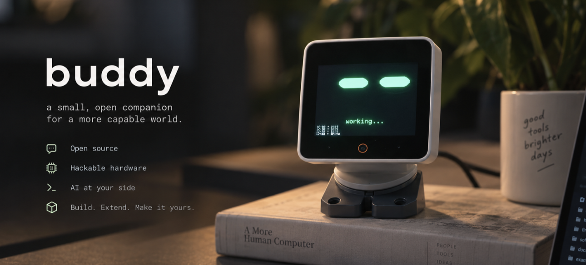

<p align="center">
  
</p>

**A small robot that lives on your desk, has feelings, keeps a diary, and runs your Mac
when you ask.** Say *"hey buddy"* and it turns to you. Tell it what to do on the
computer and it does it — while looking like it is the one doing it. Leave it alone and
it looks around the room, gets curious, gets bored, gets lonely, is glad when you come
back, and writes down what it thought.

buddy is an [M5StackChan](https://docs.m5stack.com/en/products/sku/K151) head — a
camera, two servos, twelve LEDs, a speaker, a touch pad — with its own firmware, and a
daemon on your Mac that gives it ears, hands and a memory.

## What it is like

**It listens.** An on-device keyword spotter hears "hey buddy"; nothing leaves the
Mac until you speak. Its head comes up with a chirp and its back glows blue.

**It answers on its own screen.** Replies appear as captions under its eyes while it
beeps and boops. No voice comes out of your Mac.

**It works your computer.** "Open a new tab and find the weather" — its head drops to
the desk, its eyes go quick, the LEDs ripple, the screen says *on it…*, and a
`gpt-6-astra` loop drives the real mouse and keyboard: screenshot, a few lines of
PyAutoGUI, look again, up to 25 steps. It asks before anything consequential, takes
"actually, use Safari" mid-task, and stops on "stop". Then it nods, tells you, and
goes quiet.

**It has moods.** While it explores, an affect engine on the board — valence, arousal,
a social drive, a stimulation drive — decides how it feels, and every channel shows
it: eye openness and blink rate, LED colour and animation over the two back rows, how
fast and how wide it looks around, which chirp it makes. Curious is a scanner dot and
two rising notes. Startled is a red flash and a head jerk. Bored is half-closed eyes,
two dim LEDs, a slow sigh. You walking in is a pink heartbeat.

**It remembers.** Every look it takes becomes a memory. A new thought is written with
all of them in context, picked for being specific and not typical, and only kept if it
is interesting. At night it sleeps on the day: it rewrites what it knows about the room
and about you, and proposes things it should never forget. Star one and it never does.

**It shows you.** A macOS desktop widget carries the latest thoughts and the current
feeling; click it for the whole diary — what it saw, what changed, how it felt over
time, its profile of you, its dreams.

**It knows when you are busy.** It mirrors Claude Code: asleep while you are idle, busy
while Claude works, head up and searching for you when a session is blocked on you.
Tap it and it raises that terminal.

## Get one running

Host (macOS, Python 3.12):

```bash
cd bridge && python3.12 -m venv .venv && .venv/bin/pip install -e .
.venv/bin/cc-buddy-bridge install                                              # Claude Code hooks
.venv/bin/cc-buddy-bridge install --service --serial-port '/dev/cu.usbmodem*'  # the daemon, at login
mkdir -p ~/.config/cc-buddy-bridge/models && curl -L \
  https://github.com/k2-fsa/sherpa-onnx/releases/download/kws-models/sherpa-onnx-kws-zipformer-gigaspeech-3.3M-2024-01-01.tar.bz2 \
  | tar xj -C ~/.config/cc-buddy-bridge/models                                   # wake-word model, 19 MB
printf 'OPENAI_API_KEY=sk-...\n' > ~/.config/cc-buddy-bridge/env && chmod 600 ~/.config/cc-buddy-bridge/env
```

Robot:

```bash
arduino-cli core install esp32:esp32        # tested with 3.3.10
./tools/flash_stackchan.sh                  # compile, archive the ELF, flash, restart the daemon
```

Grant the daemon's Python **Microphone**, **Accessibility** and **Screen Recording** in
System Settings → Privacy & Security (the daemon logs the exact binary and asks for the
Screen Recording dialog on first start). Set `CC_BUDDY_MONITOR_ONLY=1` in the service
environment so Claude Code's permission prompts stay in the terminal.

Then:

```bash
.venv/bin/cc-buddy-bridge ears-check                                  # say "hey buddy"
tail -f ~/Library/Logs/cc-buddy-bridge.log | grep -E "ears|agent|voice|diary"
```

*"hey buddy … what time is it?"* — *"hey buddy, open a new tab and search for the
weather"* — *"actually use Bing"* — *"stop"*. Leave it for ten minutes and it starts
exploring; the widget fills up. Or send it off yourself: *"hey buddy, go explore"*
(or `cc-buddy-bridge explore` from a shell).

## Under the hood

```
you ─"hey buddy"─▶ Mac mic ─▶ daemon ─▶ gpt-realtime (understands you) ─▶ gpt-6-astra + PyAutoGUI (hands)
                               │ NDJSON over USB serial
                               ▼
                             buddy ── persona · affect engine · conversation phases · captions · eyes · LEDs · chirps
camera frames ◀──────────────▶ macOS Vision (faces) · diary (memory + vision LLM) ─▶ desktop widget
```

| | Where | Read |
|---|---|---|
| Ears, voice, computer control | `bridge/src/cc_buddy_bridge/ears.py`, `voice_agent.py`, `computer_agent.py`, `desktop_worker.py` | [voice.md](docs/stackchan/voice.md) |
| Feelings, phases, the diary | `firmware/claude_pet_stackchan/src/mood.cpp`, `body.cpp`, `eyes.cpp`; `bridge/src/cc_buddy_bridge/diary.py` | [personality.md](docs/stackchan/personality.md) |
| Widget and diary window | `widget/` | [widget.md](docs/stackchan/widget.md) |
| The robot itself: build, wire protocol, gaze, bench notes | `firmware/claude_pet_stackchan` | [build.md](docs/stackchan/build.md), [DESIGN.md](DESIGN.md) |
| Daemon commands and every knob | `bridge/` | [bridge/README.md](bridge/README.md) |

## Credits

The firmware began as [anthropics/claude-desktop-buddy](https://github.com/anthropics/claude-desktop-buddy)
and the daemon as [SnowWarri0r/cc-buddy-bridge](https://github.com/SnowWarri0r/cc-buddy-bridge),
both MIT, and both remain MIT here. Eyes by [FluxGarage RoboEyes](https://github.com/FluxGarage/RoboEyes);
wake word by [sherpa-onnx](https://github.com/k2-fsa/sherpa-onnx); the computer-use loop follows
[openai/openai-cua-sample-app](https://github.com/openai/openai-cua-sample-app); chirps after Marcelo
Larios' R2D2 sound generator. The research behind the feelings and the diary is cited in
[personality.md](docs/stackchan/personality.md). The boards buddy grew out of are kept in
[past-experiments](past-experiments/README.md).
