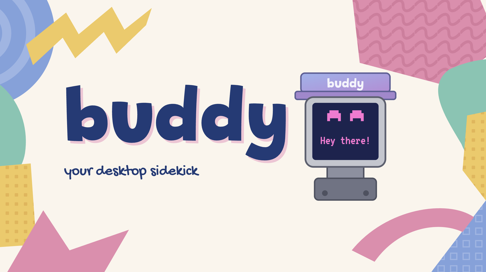
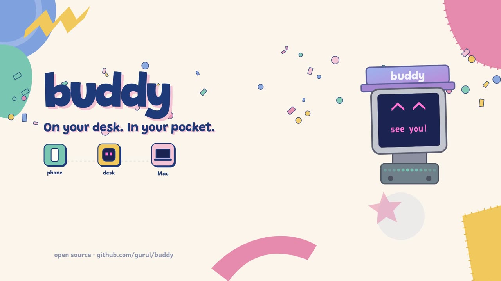
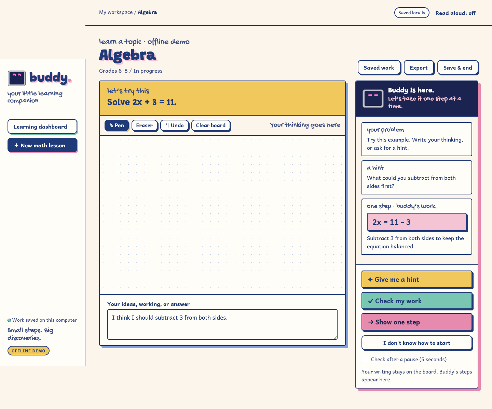
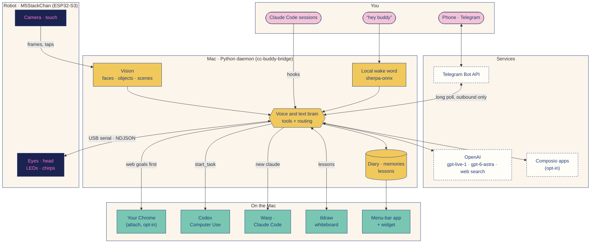

<p align="center">
  
</p>

# buddy

**A small robot that lives on your desk, with a Mac as its host.** buddy listens for
“hey buddy,” follows the person talking to it, helps with computer tasks, and keeps a
diary of what it notices. Its eyes, head, LEDs and chirps show what it is doing and
how it feels. Away from the desk, you can text it.

The robot is an **M5StackChan K151 (CoreS3 / ESP32-S3)** running custom Arduino
firmware, connected over USB serial to a Python daemon on the Mac. A native macOS app
and desktop widget show its diary, memories and lessons.

<p align="center">
  <a href="docs/assets/buddy-launch.mp4"></a>
  <br>
  <a href="docs/assets/buddy-launch.mp4"><b>▶ Watch the launch film</b></a> · 93 s · <a href="docs/launch-video/remotion/README.md">how it was made</a>
</p>

**Contents:** [What buddy does](#what-buddy-does) ·
[Get started](#get-started) · [How it works](#how-it-works) ·
[Data and controls](#data-and-controls) · [Repository guide](#repository-guide) ·
[Development](#development) · [Credits](#credits)

## What buddy does

### On your desk

- **Listens and responds.** Local wake-word detection starts a voice session. By
  default, replies appear as captions on the robot while it chirps; spoken audio
  through the Mac is optional. Web search and a reasoning backend handle questions
  that need more than a quick reply.
- **Sees and moves.** Host-side face detection helps it follow a conversation
  partner, recognise its owner, and remember where they usually sit. It can look
  for an object, explore the room, take a photo on request, or dance.
- **Has moods and a diary.** An on-board affect engine drives expressions, movement,
  LED patterns and chirps. The host keeps observations, selected thoughts and
  photos, a room/person profile, and nightly reflections. Conversation memories
  are stored separately as distilled notes; “remember that” promotes a spoken fact.
- **Mirrors Claude Code.** Session hooks and transcript updates make buddy sleep,
  work, celebrate, or ask for attention. A tap can focus a waiting terminal;
  Claude Code permission prompts remain in that terminal.
- **Shows its day.** The macOS menu-bar app, diary window and WidgetKit extension
  show thoughts, photos, feelings, conversation notes and saved lessons, with
  microphone and daemon power controls.

### On your Mac

- **Does computer tasks.** Voice and text tasks run through Codex Computer Use,
  with progress, permission questions and “stop” relayed through buddy. See
  [how a task is routed](#how-a-computer-task-is-routed).
- **Takes notes.** `cc-buddy-bridge take-notes start` records a room-note session;
  stopping it produces a write-up of decisions, actions and open questions.

### From your phone (opt-in)

The [Telegram door](docs/stackchan/telegram.md) is **off by default**. With it on:

- **Chat, start or stop a Mac task,** answer the questions a task asks, and get a
  photo from the robot's camera or a screenshot.
- **`rundown`** summarises today's email, calendar, Slack mentions/DMs and Obsidian
  todos. It only reads.
- **`new claude`** opens Warp on the Mac with Claude Code (personal) or era-code
  (work) in a folder you pick, with tap buttons. **`claude on`** relays a running
  session to the phone: it picks the only one, offers buttons when there are
  several, and opens a new one when there are none. A 👍 on your text means it
  was typed.
- **Keeps your personal notes.** With the [second brain](docs/stackchan/second-brain.md)
  on, a text saves a note, updates a list, checks off a todo, or undoes an edit in
  your Markdown vault.

### Learning workspace

<p align="center">
  
</p>

Learn a topic at a level you describe (“Grade 4” or “I know Python, new to Rust”),
or bring a written problem or screenshot. buddy confirms an imported problem
before you start. Work on the **tldraw whiteboard**, type your ideas, or think out
loud through the robot's voice session.

The tutor is prompted to give a hint, check the first incorrect step, or show
exactly one next step, and its explanations stay beside your work. A final step may
finish the problem; the workflow is designed to avoid giving the whole solution at
once. Lessons, board revisions and feedback are saved to a searchable dashboard.

Say “lesson” to open the workspace, or ask “hey buddy, teach me something.” The
browser, voice agent and CLI share the same lesson while the daemon runs:

```bash
cc-buddy-bridge lesson start --mode learn --topic "adding fractions" --level "Grade 4"
cc-buddy-bridge lesson ideas --text "I think I add the tops"
cc-buddy-bridge lesson hint     # or: check, step
```

Live lessons use OpenAI by default, with OpenRouter opt-in and optional Exa practice
references. See [the learning guide](docs/learning.md) for the full workflow,
think-out-loud mode, configuration and current limits.

### Experimental

- **Live Laya expressions.** Local Laya can choose eleven temporary eye expressions,
  including a wink, from conversation and diary text, even while speaking. The Mac
  runs the model and the board renders the cues; Laya controls the eyes only. This
  owner-enabled mode uses the original checkpoint, because the tuned head did worse
  on fresh examples. See [controls, limits and device verification](docs/stackchan/laya-expressions/README.md)
  and the [expression-tuning study](docs/stackchan/laya-emotion/README.md).

## Get started

### 1. Try the learning workspace (no hardware)

From the repository root, with **Python 3.11+**:

```bash
python3 tools/start_learning.py --demo --data-dir .demo-data --port 48767
```

Open [the demo](http://127.0.0.1:48767/) and choose **Play workflow demo**, or work
through an example yourself. No bridge install or API key is needed. The offline
demo uses fixed math examples and does not recognise handwriting or images. There
is also a [recorded walkthrough](docs/learning-demo/buddy-learning-demo.webm).

For live tutoring, put `OPENAI_API_KEY=...` in `~/.config/cc-buddy-bridge/env`, then
run `python3 tools/start_learning.py`. This serves
[the learning dashboard](http://127.0.0.1:48766/); if the daemon already serves that
port, use its dashboard instead. Standalone mode gives tutoring and the board; robot
voice needs the daemon. Use `--env-file /path/to/env` for a settings file elsewhere,
including in WSL.

### 2. Set up the Mac host

The full robot experience targets **macOS** (the bridge declares Python 3.11+; the
setup below uses 3.12). macOS Vision, Accessibility and the widget are
platform-specific. The bridge also has Linux/Windows service and legacy BLE support,
without the complete Mac experience.

```bash
python3.12 -m venv bridge/.venv
bridge/.venv/bin/python -m pip install -e ./bridge

mkdir -p ~/.config/cc-buddy-bridge/models
curl -fL \
  https://github.com/k2-fsa/sherpa-onnx/releases/download/kws-models/sherpa-onnx-kws-zipformer-gigaspeech-3.3M-2024-01-01.tar.bz2 \
  | tar xj -C ~/.config/cc-buddy-bridge/models

touch ~/.config/cc-buddy-bridge/env
chmod 600 ~/.config/cc-buddy-bridge/env
```

Add your credentials to that file, keeping any existing entries:

```dotenv
OPENAI_API_KEY=your-key-here
# Optional: practice references for live lessons
# EXA_API_KEY=your-key-here
```

Install the Claude Code hooks and the login service:

```bash
bridge/.venv/bin/cc-buddy-bridge install
bridge/.venv/bin/cc-buddy-bridge install --service --serial-port '/dev/cu.usbmodem*'
```

Grant the daemon's Python **Microphone**, **Accessibility** and **Screen Recording**
in System Settings → Privacy & Security; the daemon logs which binary needs it.
Restart the daemon after changing its environment file.

### 3. Build and connect the robot

Follow the [firmware build guide](docs/stackchan/build.md) to install the Arduino
libraries and back up the factory firmware before the first flash. The build uses
ESP32 core **3.3.10**, M5Unified/M5GFX, RoboEyes, AnimatedGIF and StackChan-BSP.
**StackChan-BSP must include commit `8d4d6fc`**: the `1.1.0` tag lacks
`TouchSensor.recalibrate()` and does not compile this firmware. Reference clones
under `vendor/` are gitignored; see [dependency setup](docs/stackchan/repos.md).

```bash
arduino-cli core install esp32:esp32@3.3.10
./tools/flash_stackchan.sh
```

The flash script compiles the firmware, archives its ELF, frees the serial port from
the login service, uploads, and restarts the service if it was running. Connect the
robot by USB and check the wake word:

```bash
bridge/.venv/bin/cc-buddy-bridge ears-check   # then say “hey buddy”
tail -f ~/Library/Logs/cc-buddy-bridge.log
```

Try “hey buddy, what time is it?”, “hey buddy, open Safari”, or “hey buddy, go
explore.” For the widget and diary app, follow the
[widget build and signing instructions](docs/stackchan/widget.md) (macOS 14+).

<details>
<summary><b>Troubleshooting</b></summary>

- **Wakes but stalls:** see the [voice troubleshooting guide](docs/stackchan/voice.md#when-buddy-hears-you-and-then-sits-still).
- **Sees camera frames but stops following faces:** see the
  [face-tracking notes](docs/stackchan/vision.md#following-whoever-is-talking).
- **Noise between chirps:** the speaker amplifier stays off between chirps, and the
  external 5 V supply stays off after boot to remove the confirmed idle whine. This
  disables the rear LEDs and top touch sensor; the screen and head motors have their
  own supplies. If an older build makes noise, reflash. For noise that persists while
  muted, the [build guide](docs/stackchan/build.md) describes timed screen, motor and
  power-output isolation tests.

</details>

## How it works

buddy splits real-time embodiment from host-side perception, storage and model
calls. The firmware keeps the face and body responsive; the Python daemon
coordinates voice, tasks, lessons and memory.



| Component | Implementation and responsibility |
|---|---|
| Robot firmware | Arduino C++ on ESP32-S3; M5StackChan BSP and M5Unified for hardware, RoboEyes for the face. Local state machines handle gaze, affect, conversation phases, motion and synthesised chirps. |
| Host bridge | Python with `asyncio`; `cc-buddy-bridge` is the CLI and daemon entry point. Hooks and CLI commands use local JSON IPC; the robot link is newline-delimited JSON over USB serial. |
| Voice and reasoning | sherpa-onnx keyword spotting with sounddevice audio input; the configured defaults are `gpt-live-1` for voice and `gpt-6-astra` for reasoning. Captions are the default output. Voice, text and deep reasoning use OpenAI's built-in web search by default (`websearch.py`); Exa is opt-in. |
| Desktop control | The voice and text `start_task` tool delegates to Codex app-server and its installed `cua_repl.js` Computer Use plugin. Progress, explicit permissions, results, steering and cancellation return through buddy. |
| Vision and memory | macOS Vision for face detection, host-side identity/following logic, model-assisted scene observations and reflections, plus separate diary and conversation stores. |
| Learning | Python HTTP service on `127.0.0.1:48766`, SQLite persistence, and a React/TypeScript tldraw canvas built with Vite. Tutor responses use a validated JSON shape for problems, feedback, steps and completion state. |
| Native UI | SwiftUI menu-bar app and diary window, with a WidgetKit extension. The helper mirrors local data into an App Group snapshot for the widget. |
| Memory integrations | In-process publish/subscribe bus; optional rosbridge-compatible WebSocket endpoint and claude-mem sink/recall. Neither is required. |

### How a computer task is routed

`start_task(goal)` creates a fresh, ephemeral Codex session through
`codex_computer.py`, after checking that `cua_repl.js` is installed and enabled.
Codex drives native apps through its `cua` API while buddy relays progress and
permission choices.

- **Your own Chrome first (opt-in):** with `CC_BUDDY_BROWSER_ATTACH=1`, web goals try
  your logged-in Chrome first. Chrome's “Allow remote debugging?” prompt is answered
  from your phone (a no or silence cancels), buddy works in its own tab, and anything
  unfinished goes to Codex. See [attach mode](docs/stackchan/routing.md#controlling-your-logged-in-chrome-attach-mode).
- **Stopping:** `stop_task` interrupts Codex, even while a permission is pending.
- **Permissions:** app prompts offer `yes`, `allow for task` and `always allow` when
  Codex permits them. Saved grants belong to Codex and are revoked in its Computer
  Use settings. `CC_BUDDY_CODEX_SITE_ACCESS=allow` skips the extra Telegram question
  for ordinary website-access prompts (default `ask`); it never approves uploads,
  raw browser access, sign-in handoffs or other actions.
- **Pictures:** browser tasks return a capture of their own tab. A missing capture is
  reported rather than replaced with an unrelated desktop screenshot.
- **Limits:** a read-only filesystem sandbox, approvals on request, and a ten-minute
  task budget. `CC_BUDDY_CODEX_BIN` selects a Codex executable (default: the desktop
  app's bundled one). There is no fallback if Codex is unavailable.

See [integration evidence and limits](docs/codex-computer-use/README.md).

<details>
<summary><b>The legacy worker</b> (<code>computer_agent.py</code>, kept but no longer selected)</summary>

1. **Code shortcuts** handle recognised app launches and web searches (`task_router.py`).
2. **Accessibility routing** handles requests fully described by a labelled UI control
   (`lane_router.py` over `fast_lane.py` and `ax_candidates.py`).
3. **Plan once, execute with Jev** (`CC_BUDDY_PLAN_EXEC=1`): the planner makes one typed
   plan (`plan_contract.py`) and `plan_executor.py` walks it, grounding each click on a
   fresh Accessibility snapshot with the keyword gate and hosted Jev
   (`typed_ask.ask_jev_step`). Consequential steps stop and ask you; a plan cannot
   approve them.
4. **The planner** handles remaining work turn by turn with screenshots and Python
   desktop helpers, and catches any plan that cannot be made or finished.

Tiers 1–2 are on by default in that worker. Tier 3 and the planner-delegated fast lane
(`decider.py`, the `[fast]` extra) are **off by default**. Optional typed-decision
backends are **local Laya via MLX** on Apple silicon and **hosted Jev**, which can also
drive narrowly scoped launch routing and spoken head moves. Clicks use accurate OCR
directly, and a finished screen wait is reused for the reply screenshot. The
**browser lane** (`browser_lane.py`, off by default; `CC_BUDDY_BROWSER_LANE=0`) drives
buddy's own Chromium with Playwright; attach mode reuses it for your own Chrome.

See [routing](docs/stackchan/routing.md) for switches and measured evaluations, and
[voice and computer control](docs/stackchan/voice.md) for worker details.

</details>

### The Telegram door

`telegram.py` long-polls the Telegram Bot API over outbound HTTPS, so there is no open
port. It needs a switch, a bot token and one allowlisted numeric owner id together.
Every message is shaped for the phone by `telegram_format.py`.

| Feature | What it does |
|---|---|
| Chat and tasks | Chat with buddy, start and stop a Mac task, answer a task's question, receive a camera photo. |
| Images | Send photos or image files with captions (still JPEG/PNG/WebP/GIF, up to 10 MB). See [image routing and retention](docs/stackchan/telegram.md#receiving-images). |
| `rundown` | Today's email, calendar, Slack and Obsidian todos through the packaged [rundown skill](bridge/src/cc_buddy_bridge/skills/rundown/SKILL.md). Read-only; names disconnected sources, never result limits. |
| `claude on` | Streams Claude Code's visible text to the phone (never the gray tool lines or thinking) and types your replies in; tool calls run as in bypass mode. Jev judges each relayed shell command for risk (shadow by default). |
| `codex on` / `codex <folder>` | Starts a new Codex chat in a saved folder, with approvals relayed to Telegram. `stop` interrupts, `codex off` returns to buddy, `buddy:` addresses buddy directly. |
| `new claude` | Opens a coding session in Warp from a few short texts. |
| Records (`CC_BUDDY_RECORDS=1`) | Typed, git-tracked markdown records and a profile, written only by a nightly reconcile (`records.py`). |
| Composio (`CC_BUDDY_COMPOSIO=1`) | Your apps by API (`composio_tools.py`): Gmail read-only, calendar writable, Drive and the rest asked first. |
| Second brain (`CC_BUDDY_SECOND_BRAIN=1`) | Texts become notes in a local markdown vault Obsidian opens (`second_brain.py`). |

buddy also gets a local clock snapshot and your configured location and timezone
([voice settings](docs/stackchan/voice.md#knobs)). Full guide:
[text buddy through Telegram](docs/stackchan/telegram.md).

## Data and controls

Wake-word detection runs locally. Live voice, tutoring, reasoning and scene analysis
use the configured model providers, and the relevant audio, text, board images or
camera frames are sent for those requests. Computer tasks send screenshots. Local
storage does not make those features offline. With the Telegram door on, your texts
and buddy's replies also pass through Telegram's servers.

Persistent data lives under `~/.config/cc-buddy-bridge/`:

| Location | Contents |
|---|---|
| `env` | API credentials and runtime settings |
| `notes/` | Diary Markdown, observation JSONL, profiles, highlights and photo records |
| `debrief/` | Distilled conversation memories and promoted spoken facts; with records on, a git repository holding `records/` |
| `learning/` | `lessons.sqlite3` and saved lesson/whiteboard data |
| `agent-runs/` | Desktop-task run logs |

- `cc-buddy-bridge mic off` disables microphone capture until re-enabled.
- The menu-bar app and desktop widget have a persistent **Turn buddy off / on** control.
- `CC_BUDDY_ROSBRIDGE=1` exposes memory events at `ws://127.0.0.1:9090` (no
  authentication, loopback by default); `CC_BUDDY_CLAUDE_MEM=1` saves them to a local
  claude-mem worker. Both are off by default. The event bus excludes conversation
  transcripts and learner input; lesson events carry metadata and buddy's feedback.
  See [memory-bus.md](docs/memory-bus.md).

## Repository guide

| Path | What is here | Documentation |
|---|---|---|
| `firmware/claude_pet_stackchan/` | Active StackChan firmware and C++ host tests | [Build and protocol](docs/stackchan/build.md), [design](DESIGN.md) |
| `bridge/src/cc_buddy_bridge/` | Daemon, CLI, voice, desktop control, vision and memory | [Bridge reference](bridge/README.md), [voice](docs/stackchan/voice.md), [routing](docs/stackchan/routing.md), [Telegram](docs/stackchan/telegram.md) |
| `bridge/src/cc_buddy_bridge/learning/` | Lesson service, tutor, SQLite store and served web assets | [Learning guide](docs/learning.md) |
| `bridge/web-canvas/` | React/TypeScript whiteboard source and browser checks | [Whiteboard details](docs/learning.md#the-whiteboard-tldraw) |
| `bridge/tests/`, `bridge/tools/` | Python tests, fixtures and routing/desktop evaluation tools | [Routing evaluations](docs/stackchan/routing.md) |
| `widget/` | SwiftUI app, shared data readers, WidgetKit extension and Xcode project | [Widget setup](docs/stackchan/widget.md) |
| `tools/` | Firmware flashing, standalone learning launcher and demo utilities | [Build](docs/stackchan/build.md), [learning](docs/learning.md) |
| `docs/stackchan/` | Hardware notes, personality, vision and integration details | [Personality](docs/stackchan/personality.md), [vision](docs/stackchan/vision.md), [Claude Code](docs/stackchan/claude-code-integration.md) |
| `docs/launch-video/` | Launch films (Remotion), script and reference material | [Video project](docs/launch-video/remotion/README.md) |
| `past-experiments/` | Earlier boards, e-ink firmware and enclosure experiments | [Archive overview](past-experiments/README.md) |

## Development

Install the Python development tools and run the bridge checks from the repository root:

```bash
bridge/.venv/bin/python -m pip install -e './bridge[dev]'
(cd bridge && .venv/bin/pytest -q)
(cd bridge && .venv/bin/ruff check src/ tests/)
```

- **Live tests.** A plain run never touches this Mac's real services. Tests marked
  `live` write to the real claude-mem worker or launch a real Chromium, so they run only
  when asked: `(cd bridge && CC_BUDDY_LIVE=1 .venv/bin/pytest -q -m live)`.
- **Routing evals.** These call Jev, which receives the request text, and print their
  ship decision: `(cd bridge && .venv/bin/python tools/route_eval.py [--quit | --browser | --model jev --native])`.
- **Whiteboard.** The served bundle is checked in. After changing the React/TypeScript
  source, rebuild with `(cd bridge/web-canvas && npm ci && npm run build)`, which
  writes into `bridge/src/cc_buddy_bridge/learning/web/canvas/`.
- **Firmware.** Host tests live in `firmware/claude_pet_stackchan/host/`; the
  [build guide](docs/stackchan/build.md) covers hardware setup and bench conventions.
- **Learning.** Browser and live-tutor checks are in the [learning guide](docs/learning.md).

Hardware, live APIs and macOS-specific integrations need their own setup beyond the
offline demo.

## Credits

The lessons were built for the OpenAI, OpenRouter and CopilotKit *Agents,
Everywhere: Bots, Channels & More* global hackathon by **Gurucharan Lingamallu,
Swetank Griyage and Emaha Tekle**. The whiteboard began with Swetank's `smartboard`
work; the tutor, voice integration and widget cards were developed on buddy and
merged back here. The hackathon fork, first launch film and presentation are in
[gurul/buddyTinkerer](https://github.com/gurul/buddyTinkerer). The cut-paper
illustration above also comes from that project.

The firmware began as [anthropics/claude-desktop-buddy](https://github.com/anthropics/claude-desktop-buddy)
and the bridge as [SnowWarri0r/cc-buddy-bridge](https://github.com/SnowWarri0r/cc-buddy-bridge).
Other foundations include FluxGarage RoboEyes, sherpa-onnx, M5Stack's libraries,
and OpenAI's computer-use sample; the chirps draw on Marcelo Larios' R2D2 sound
generator. Practice references use Exa. Research behind the affect engine and diary
is cited in [personality.md](docs/stackchan/personality.md).

See the [bridge license](bridge/LICENSE), [canvas attribution](bridge/web-canvas/LICENSE.md),
[tldraw license](bridge/web-canvas/TLDRAW-LICENSE.md), and bundled font license
notices for the respective components.
