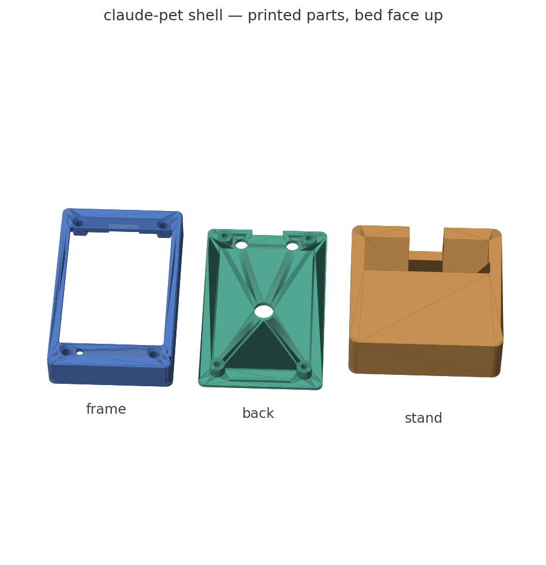

# Experiments that led to buddy

buddy grew out of three earlier builds on two other boards. They still work,
share the same NDJSON protocol and daemon, and are kept here for anyone with
that hardware. The robot in the top-level README is the project; this folder is
its history. Paths below are relative to the repository root.

## Touch pet (Freenove FNK0104B, ESP32-S3 2.8" touch LCD)

The first build: the 7-state desk pet from claude-desktop-buddy, retargeted from the
M5StickC Plus to a 240×320 touch panel (`firmware/claude_pet`). Permission prompts
arrive as a card you approve or deny by swiping — right to approve, left to deny;
hold at the right edge to approve and stop being asked for that command shape; tap
the card for the whole command; swipe up to raise the asking terminal. Hold the pet
to dictate (opt-in, `CC_BUDDY_VOICE_HOTKEY`), swipe down for Enter, swipe left/right
through Claude Code's option pickers. A WS2812 pulses orange while an approval is
pending. The parametric 3D-printed shell for this board is in `case/`.

##### Touch pet hardware

| Part | Detail |
|---|---|
| MCU | ESP32-S3, 16MB QIO flash, 8MB OPI PSRAM, native USB-Serial/JTAG |
| LCD | ILI9341(V) 240×320 SPI — MOSI 11 / SCLK 12 / CS 10 / DC 46, backlight GPIO45 |
| Touch | FT6336G @ I2C 0x38 — SDA 16 / SCL 15 / INT 17 / RST 18 |
| Extras | WS2812 LED (GPIO42), ES8311 codec + mic + speaker (unused), microSD, battery ADC GPIO9 |

##### Touch pet controls

| Gesture | Action |
|---|---|
| **Swipe card right / left** | approve / deny the pending prompt |
| **Hold card at the right edge** (700ms) | stamp flips to ALWAYS — approve and stop carding this command shape for the daemon's lifetime |
| **Tap the card** | expand to a full-screen view of the whole command (long commands truncate on the card); tap again to close |
| **Swipe the card up** | raise the asking session's terminal — the card stays pending (look before you decide) |
| **Tap the pet** (attention state only) | raise the terminal of the session that's blocked on you |
| **Hold the pet** | push-to-talk: holds your dictation hotkey while held |
| **Swipe down** (anywhere) | press Enter on the Mac |
| **Swipe left / right** (no card up) | previous / next option in Claude Code's pickers (Up/Down arrow) |
| Tap bottom-right | scroll back through the transcript |

There is no on-device menu, settings, or info screen — the pet is always the
whole UI. Species and settings are host-side via the CLI
(`cc-buddy-bridge species`, `matchers.toml`); battery and link state via
`cc-buddy-bridge status` / `diag`.

The WS2812 pulses orange while an approval is pending, green on celebrate, pink on heart,
solid blue while dictating.

##### Build & flash (touch pet)

```bash
arduino-cli core install esp32:esp32          # tested with 3.3.10
arduino-cli lib install ArduinoJson AnimatedGIF TFT_eSPI

./tools/flash.sh                              # compile → archive ELF → flash → restart daemon
```

`tools/flash.sh` handles the whole dance: it compiles, files the exact ELF away under
`firmware/build-archive/` (so any future panic backtrace stays symbolizable), boots the
daemon **out** (it owns `/dev/cu.usbmodem*` exclusively and the plist sets `KeepAlive`, so
merely stopping it isn't enough — esptool would fail looking exactly like a bricked board),
uploads, and bootstraps the daemon back. If the flasher still can't connect: hold **BOOT**,
tap **RESET**, release BOOT, retry.

### E-ink build (CrowPanel 4.2")

The second board: the **Elecrow CrowPanel ESP32 4.2" E-Paper HMI**
(ESP32-S3-WROOM-1-N8R8, SSD1683, 400×300 black/white, CH340 UART on the
USB-C) — `firmware/claude_pet_eink`, same NDJSON protocol, **no pet**: on
e-paper the build is a purely functional portrait status display — big
clock + date, a state banner (IDLE / WORKING / NEEDS YOU / DONE!), session
and token counters, the tail of the live transcript, and permission prompts
as a full-screen card. Redraws happen on state changes, prompt traffic, and
the minute tick: partial refresh for routine updates, a fast full refresh
every 24 partials (and on card in/out) to clear ghosting, deep sleep between
updates. The front controls (two buttons + a rocker/press "slider"):

| Control | No card up | Card showing |
|---|---|---|
| slider press (OK) | Enter on the Mac | approve once; hold 0.7s = always. Destructive prompts *require* the hold — a short tap just draws "HOLD OK to approve" |
| slider up / down | previous / next option in Claude Code's pickers | up = approve once, down = deny — the swipe, made physical. Destructive prompts won't approve from a flick; they point you at the OK hold |
| EXIT | **hold = push-to-talk** — the daemon holds your dictation hotkey until you let go | deny |
| MENU/HOME | raise the blocked session's terminal | raise the asking session's terminal (card stays pending) |

```bash
./tools/flash_eink.sh    # compile + archive ELF + flash (through `hwlog flash` when its daemon owns the port)
cc-buddy-bridge install --service --serial-port '/dev/cu.usbserial-*'   # CH340 enumerates as usbserial, not usbmodem
```

GIF character packs don't apply on a 1-bit panel with no filesystem — the
board refuses `char_begin` at the handshake, and the daemon logs one cosmetic
"LittleFS unformatted" error per connect. `name`/`owner`/`species` commands
all ack. See `firmware/claude_pet_eink/README.md` for the vendored Elecrow
panel driver (including the old-image-plane fix that stops partial-refresh
text overlap) and the pin map, and DESIGN.md for the port notes.

### E-ink agent monitor (variant)

`firmware/claude_pet_eink_monitor` is a **variant of the e-ink build for the
same CrowPanel hardware** — not a third board, and not a replacement.
`claude_pet_eink` remains the **monitor-and-control** build: it shows status
*and* you act on it, approving prompts with the buttons. This variant is
**monitor-only** — a read-only landscape wallboard that answers "what are my
agents doing right now" and nothing else. Same NDJSON protocol, same driver,
same flashing dance; pick whichever suits the board's job and flash that one.

|  | `claude_pet_eink` | `claude_pet_eink_monitor` |
|---|---|---|
| Orientation | portrait 300×400, USB-C down | landscape 400×300, USB-C **left** |
| Permission cards | full-screen card, buttons decide | **never drawn** — approvals happen in the terminal |
| Buttons | OK / EXIT / slider / MENU all live | **inert** (pins still configured) |
| Per-agent rows | — | up to 6: name, state, current tool |
| Panel refresh | partial + periodic full | **full init + full refresh every frame** |
| Daemon | default | **requires `CC_BUDDY_MONITOR_ONLY=1`** |

The screen is a clock + AM/PM date, a state banner, `N sess / N run`, today's
tokens, an `AGENT / STATE / TOOL` table of live sessions (waiting first, then
running, then idle — ordered by rank then name so rows don't hop between
refreshes), and the transcript tail filling whatever is left.

```bash
./tools/flash_eink_monitor.sh    # compile + archive ELF + flash
CC_BUDDY_MONITOR_ONLY=1 cc-buddy-bridge daemon   # or add it to the service env
```

**Set `CC_BUDDY_MONITOR_ONLY=1` — the firmware and the flag are a matched
pair.** Without it the daemon still surfaces permissions to a board whose
buttons no longer answer, so every prompt stalls the tool call for the full
`PERMISSION_WAIT_SECS` (300s) before falling back to the terminal. With it,
the daemon takes the same defer path it uses for a disconnected board, so
Claude Code's own prompt runs immediately. The `auto_allow` / `stick_always`
matcher fast paths are unaffected — they never touched the screen.

Two behaviours worth knowing:

- **Sessions self-register.** `SessionStart` is normally the only hook that
  creates a session, so a daemon restart used to leave every already-running
  session invisible until you restarted it too. Tool hooks now adopt unknown
  sessions (and backfill the `cwd` that names the row), so the list heals
  within one tool call. A row labelled with a six-char hex prefix instead of
  a repo name is a session that hasn't hit a `cwd`-carrying hook yet.
- **The clock self-heals.** The host sends `{"time":...}` once on connect, and
  opening the CH340 port toggles DTR/RTS — which resets the board, so the sync
  can land while the ESP32 is still in its ROM bootloader and be lost. The
  board re-emits its boot banner while it has no clock; the daemon's existing
  boot detector replays the resync and it goes quiet once time arrives.

### Why this variant does not use partial refresh

`EPD_Wake()` does reset + soft-reset + temperature-select only — it never
re-sends data-entry mode (`0x11`), the address window, or the cursor, all of
which `EPD_Init()` sets and a hardware reset clears. So from the second
sleep/wake cycle on, a partial refresh writes into an unconfigured controller
and nothing lands, **silently**, because `EPD_ReadBusy()` gives up after 8s
and returns normally. The symptom is a frozen panel while the firmware
happily counts renders. This variant therefore runs a full `EPD_Init()` +
`EPD_Display()` every frame — the same sequence `EPD_Clear()` uses at boot —
rate-limited by `MIN_FRAME_MS`. It costs a ~2s flashing refresh, deghosts for
free, and makes the panel self-healing: a controller wedged by a mid-refresh
reset recovers on the next frame instead of staying dead until a power cycle.
`claude_pet_eink` still uses the partial path and is still exposed to this.

**The bridge is board-agnostic.** Any device that speaks the NDJSON contract
over a serial port (or BLE NUS) is a valid pet: parse the heartbeat
(`total`/`running`/`waiting`/`prompt`/`entries`/`time`), print `[alive]`
every 5s, answer `{"cmd":"status"}` with a status ack, and emit
`permission`/`focus`/`key`/`voice` verbs from whatever inputs the hardware
has. The three firmwares here (240×320 touch LCD, 400×300 e-paper + buttons,
and the monitor-only variant of that same e-paper board) are just modalities
of the same protocol — and the monitor variant shows the floor: a board that
only ever *reads* the heartbeat is still a valid client, it simply emits no
verbs. DESIGN.md's e-ink section documents the exact contract a new board
must keep.

### Printable shell



A parametric three-part case lives in `case/` — `shell.py` builds it headless in FreeCAD
and exports STLs to `case/export/`. Frame (bezel + walls, print face down), back cover
(screw bosses, WS2812 glow window, BOOT/RESET pokeholes, print outer face down), and a
65° stand dock (print base down). All support-free. Every rebuild runs a **fit
proof**: a mock board (PCB, display module, USB body, connector overhangs) must clear
both shell parts or the build fails. Dimensions came off the real board with calipers;
see `DESIGN.md` for what's measured vs. derived.

**Current revision: v2** (`case/shell_v2.py` → `frame_v2.stl`, `back_v2.stl`,
`gauge_v2.stl`). The first print revealed the v1 hole grid was off by >2mm on both
axes; v2 uses the re-measured grid (77.18 × 41.50 center-to-center) and switches
fastening to **M3 heat-set inserts** in the back bosses (Ø4.0 × 6.8mm bores, fits
inserts up to M3×5.7) with M3×14/16 flat-head machine screws from the front. The v1
stand is unchanged and still fits — don't reprint it. Print the **gauge** first: a
1.2mm board-footprint plate with the hole grid; lay the bare PCB on it flush and
confirm daylight through all four holes before committing to the shell print.

